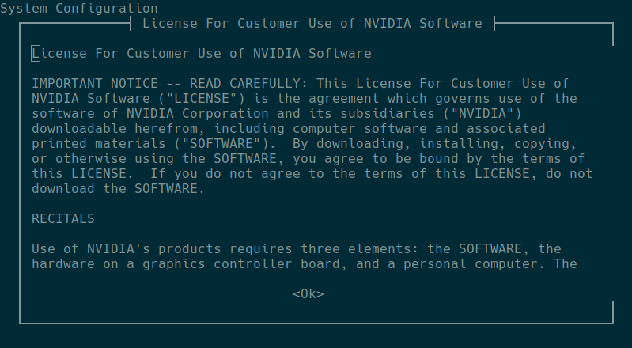
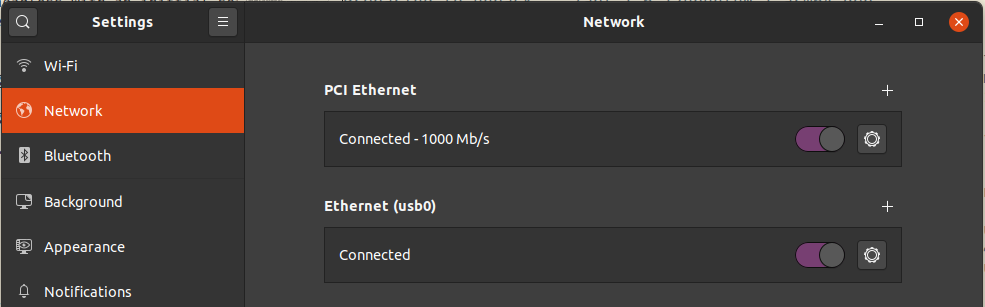
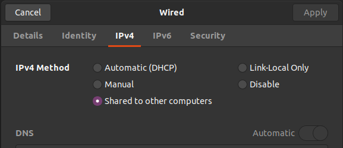

# Headless Jetson Nano Initial Setup.
This instructions have been tested with Ubuntu 18.04 and 20.04 I have attempted to provide additional information for other operating systems.

## Requirements ##
**Data capable Micro-USB cable**

**Ethernet cable**

(If your computer doesn't have an ethernet port a USB Ethernet adpater is an option https://www.apple.com/shop/product/MC704LL/A/apple-usb-ethernet-adapter)

**SD Card**

## Recommended 

In this setup you won't require the DC barrel jack charger for the Jetson Nano but it is required if you intend to do some AI related task.

The following are some of the recommended power supply.

https://www.adafruit.com/product/1466

https://www.raspberrypi.org/products/raspberry-pi-universal-power-supply/


**Do not the use the rapsberrypi charger during the initial setup, because we will connect to the Jetson Nano's Micro-USB port from the computer directly using the USB data cable.**

## Steps

**Step 1**
Download the image for the Jetson Nano

https://developer.nvidia.com/jetson-nano-sd-card-image

If you have download issues with your intenet connection/provider I recommend using the following command if you are using a Mac, Linux or WSL on Windows.

```console
wget -nc -c https://developer.nvidia.com/jetson-nano-sd-card-image
```
It is important to use the command as typed, the -nc means that it won't download the file if it is present in the location from where you are running the command, the -c means continue, in case the download gets interrupted it starts from where it left off.

**Step 2**

Burn the image to the SD Card.  Balena Etcher is recommended to burn the image.
https://www.balena.io/etcher/

**Step 3**

You will need to install the terminal multiplexer ***Screen*** (https://www.gnu.org/software/screen/) or for Windows you can use ***Tera Term*** (https://ttssh2.osdn.jp/) 

To install on Linux(Ubuntu) run the following command.

```console
sudo apt install screen -y 
```

**Step 4**
Inser the SD Card

Connect the computer to the Jetson Nano

After about 20 seconds you will see a notification that the Jetson Nano has been mounted as a USB device.  The name begins with ***ACM*** and inn order to find where it is mounted run the following command on Mac or Linux (Sorry I don't know what Windows does here.)

```console
ls -ls /dev/tty* | grep ACM
```

You will need the name staring with */dev/ttyACM* for the next step.

**Step 5**

Run the following command, note that for me the Jetson Nano was identified as ACM0, if you only have one connected it might be the same.

```console
sudo screen /dev/ttyACM0 115200
```

**Step 6**

The terminal may flash and just diplay a mostly blank screen with a blinking cursor, just press a key (I pressed Enter)

**Step 7**

If the connection was successful you will be greeted with the following message.


From here you will interact with the menu with the ***Tab, Arrow(Up, Down) and Enter*** keys.  

Press **Tab** until your selection is highlighted and then press **Enter** to accept your selection.

When asked about which network interface to configure. Choose Ethernet and connect you computer to the Jetson Nano using the Ethernet cable (or an adapter).

Most of the options are easy to understand.  When asked about the **Hostname** it basically wants to know what name you would like for your Jetson Nano.

When the setup process is done, it will end the **Screen** session.

**Step 8**

*If you are using Windows you will need to use Putty, PowerShell for the next step*

Loggin to your Jetson Nano: It has a static ip address of 192.168.55.1

Make sure you use the name you typed during the setup, my name is Antonio so I used the following command.

```console
ssh antonio@192.168.55.1
```

**Step 9**

Update your Jetson Nano software

```console
sudo apt update && sudo apt upgrade -y 
```

If you are able to log in but, you can't connect to the internet.  You need to shared your internet connection using the Ethernet from your computer. 

In **Ubuntu**: Go to ***Settings***, choose ***Network*** 

If you see multiple network adapters, the top one is usually your computer's ethernet.  




click the config icon(looks like a small gear) click on ***IPv4*** and select ***Share to other computers***



Your computer should now be sharing our internet connection to the Jetson Nano.

**Please remember that you want to be using a proper power supply when using the Jetson Nano**
