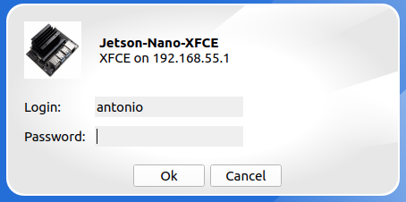

# Jetson Nano GUI From Your Desktop or Laptop
**using [X2Go](https://en.wikipedia.org/wiki/X2Go) (remote desktop software)**

**I assume that you are able to access the Jetson Nano from your computer**

# Steps

**Step 1**
On the Jetson Nano run the following commands

```console
sudo apt update && sudo apt upgrade -y
```

**Step 2**
Install [XFCE](https://en.wikipedia.org/wiki/Xfce) the GUI.

```console
sudo apt install xfce4 -y
```
**Step 3**
Install the remote desktop software that will allow you view the Jetson Nano's GUI
```console
sudo apt install x2goserver x2goserver-xsession
```

**Step 4**
Install the remote desktop client software on your computer, I am using Ubuntu.
(Install instructions for other operating systems can be found at [X2Go Client](https://wiki.x2go.org/doku.php/doc:installation:x2goclient))
```console
sudo apt install x2goclient
```

**Step 5**
Open x2goclient on your computer, you will see the following image.


In the **Session name** section:

    Type the name to identify your session (mine is Jetson-Nano-XFCE)

In the **Server** section enter the following information

    Host: 198.162.55.1
    
    Login: username(your username in the Jetson Nano)

In the **Session type** section.  

    Choose XFCE from the dropdowm menu.
    click OK

You should end up with a new session card on the upper right side of the X2Go Client window.


**Step 6**
In order to connect to the gui on the Jetson Nano click on the name of the session on the session image.  You will see a login windows appear in the center of the X2G0 Client window.



In the **password** field type your password for the Jetson Nano


**Step 7**
If everything is alright you will be greeted with a black windows and the cursor.  Wait about 20 seconds and you should see a popup windows asking to set up a profile, I chose the default profile.

You should now be able to see the GUI XFCE


